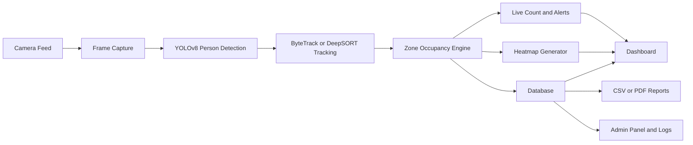
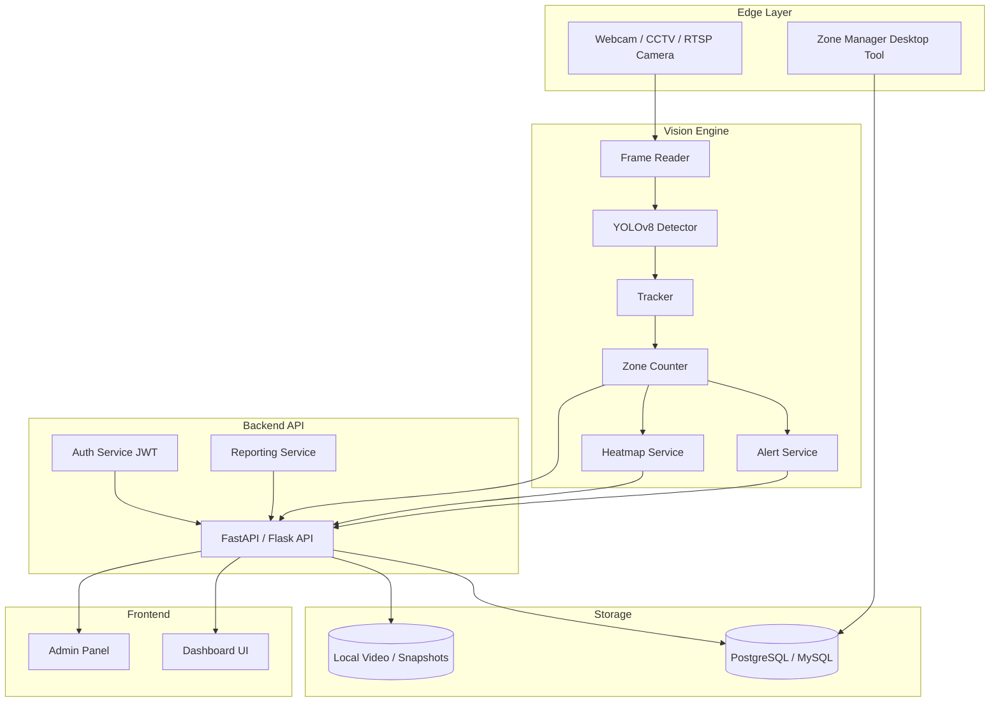
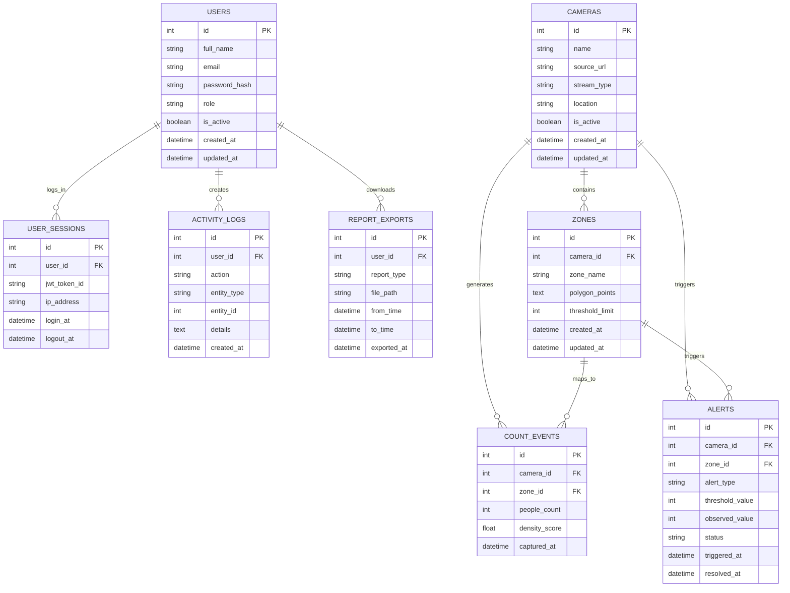

# Counting People in a Public Area Using a Camera Feed

## Project Statement
Public spaces such as malls, airports, railway stations, parks, and campuses need real-time visibility into crowd movement for safety, planning, and operations. This project uses a live camera feed, computer vision, and object tracking to detect people, count them, and measure occupancy across defined zones. The system is designed to process frames in real time, maintain person identities across consecutive frames, and expose live analytics through a dashboard and admin panel.

## Outcomes
- Real-time people counting from webcam, CCTV, or IP camera feeds.
- Zone-wise occupancy statistics with configurable crowd thresholds.
- Live dashboard with total count, zone count, alerts, trends, and heatmap overlays.
- Exportable hourly or daily reports in CSV/PDF format.
- Admin panel for camera management, zone editing, and audit logs.

## Modules to Be Implemented
### 1. Video Input and Zone Management
- Connect to webcam or IP/RTSP stream.
- Draw, edit, and save multiple ROIs for each camera.
- Persist zone coordinates, labels, and thresholds.

### 2. People Detection and Counting
- Detect people using YOLOv8.
- Track individuals using ByteTrack or DeepSORT.
- Update zone counts based on centroid position or overlap rules.

### 3. Dashboard and Visualization
- Show live total occupancy and zone occupancy.
- Plot time-series charts for crowd trends.
- Render density heatmaps on top of the video feed.
- Trigger overcrowding alerts when thresholds are exceeded.

### 4. Admin Panel and Settings
- Secure login with JWT authentication.
- Camera onboarding and zone configuration.
- Analytics history and event log review.
- Threshold tuning and alert rule management.

## Week-Wise Milestones
### Milestone 1: Weeks 1-2
- Camera integration.
- Zone drawing, preview, save, edit.
- Local storage of zone configurations.

### Milestone 2: Weeks 3-4
- YOLOv8 integration for person detection.
- Multi-object tracking with persistent IDs.
- Zone-wise people counting.

### Milestone 3: Weeks 5-6
- Live dashboard and visual charts.
- Heatmap overlay support.
- Alert engine for overcrowding.

### Milestone 4: Weeks 7-8
- JWT login and role-based access.
- Camera settings and analytics history.
- CSV/PDF exports and admin controls.

## Workflow Diagram

## Architecture Diagram

## Database Schema

## Suggested Tech Stack
- Python, OpenCV, Ultralytics YOLOv8, Supervision ByteTrack
- FastAPI or Flask for backend APIs
- React or Streamlit for dashboards
- PostgreSQL or MySQL for analytics persistence
- Redis or Celery for asynchronous alerts and report jobs

## Current Prototype Mapping
- `module1_video_input_zone_management.py`: milestone 1 foundation for drawing and saving zones.
- `module2_people_detection_counting.py`: milestone 2 foundation for detection, tracking, zone counts, and simple threshold alerts.
- `module3_dashboard_visualization.py`: milestone 3 dashboard for live KPIs, occupancy trends, alerts, heatmap visualization, and CSV exports.
- `module4_admin_panel_settings.py`: milestone 4 admin panel for login, camera registration, zone management, users, logs, and settings.
- `platform_services.py`: shared SQLite storage, alert management, reporting, and JWT-style authentication helpers.
- `zones.json`: local configuration store for camera source and zone definitions.
- `people_counts.csv`: generated runtime log for simple trend analysis and export.
